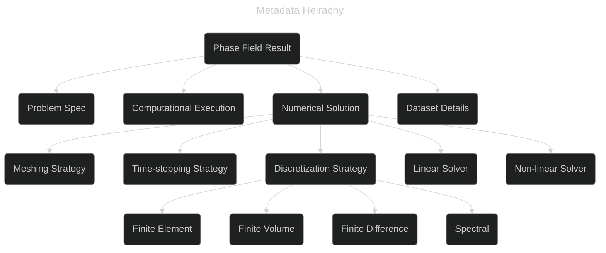

# PFHub Updates

## Phase Field Methods Workshop XVI

[https://github.com/usnistgov/pfhub]{style="color: #848482"} :inline-component{prop="value"}

---
layout: center
---

**Long Term Vision**

<v-clicks>

 - Central registry of phase field curated data with CLI/Web/API tool
   to view and query results
 - Integrated with a phase field metadata standard

</v-clicks>

---
layout: figure
figureCaption: PFHub Submission Process
figureUrl: ./images/overview.png
---


---
layout: center
---


**PFHub Updates**

<v-clicks>

 - Split out pfhub-cli into separate repository
   - [https://github.com/usnistgov/pfhub-cli][]
 - Convert to using Poetry and Poetry2Nix for builds
 - Implement bones of MkDocs documentation
   - [https://pages.nist.gov/pfhub-cli][]
 - Implement Zenodo uploads/downloads using pfhub-cli
 - Implement notebook rendering using pfhub-cli
 - Convert between old and new schemas
 - Validate old and new schemas

</v-clicks>

---
layout: center
---

**PFHub CLI Install**

```shellsession
$ pip install git+https://github.com/usnistgov/pfhub-cli.git
```

<br>

<v-clicks>

- Currently only tested with Python 3.10

</v-clicks>

---
layout: center
---

**PFHub CLI Commands**

```shellsession {1,10-12,14,17-24}
$ pfhub --help
Usage: pfhub [OPTIONS] COMMAND [ARGS]...

  Submit results to PFHub and manipulate PFHub data

Options:
  --help  Show this message and exit.

Commands:
  convert             Convert between formats (old PFHub schema to new...
  convert-to-old      Convert between formats (new PFHub schema to old...
  download            Download a PFHub record
  generate-yaml       (Not implemented) Infer a PFHub YAML file from...
  render-notebook     Render the comparison notebook for the...
  submit              (Not implemented) Submit to Zenodo and open...
  submit-from-zenodo  (Not implemented) Submit an existing Zenodo...
  test                Run the PFHub tests
  upload              Upload PFHub data to Zenodo
  validate            Validate a YAML file with the new PFHub schema
  validate-old        Validate a YAML file with the old PFHub schema

  See the documentation at https://pages.nist.gov/pfhub-cli
```

---
layout: figure
figureUrl: ./images/pfhub-cli-docs.png
figureCaption: "PFHub-CLI Docs at https://pages.nist.gov/pfhub-cli"
---

---
layout: figure-side
figureUrl: ./images/meumapps_bm1a.png
figureCaption: "PFHub meumapps_bm1a Result"
---

<br>

**Download and convert to new format**

```shellsession {1-2|3-4|5-8|9-10|11-12|13-16}
$ pfhub download meumapps_bm1a
Writing: ./meta.yaml, ./bm1a_energy_meumapps.csv
$ ls
 bm1a_energy_meumapps.csv  meta.yaml
$ head -3 bm1a_energy_meumapps.csv
time, energy
0, 319.07
0.5, 318.954
$ pfhub convert meta.yaml
Writing: ./pfhub.yaml, ./free_energy_1a.csv
$ ls
 bm1a_energy_meumapps.csv  free_energy_1a.csv  meta.yaml  pfhub.yaml
$ head -3 free_energy_1a.csv 
time,free_energy
0.0,319.07
0.5,318.954
```

---
layout: figure-side
figureUrl: ./images/zenodo.png
figureCaption: "Zenodo Record"
---

<br><br><br>

**Upload to Zenodo**

```shellsession {1-2|3-4}
$ ls
 bm1a_energy_meumapps.csv  free_energy_1a.csv  meta.yaml  pfhub.yaml
$ pfhub upload --sandbox pfhub.yaml
Uploaded to https://sandbox.zenodo.org/records/35459
```

---
layout: figure-side
figureUrl: ./images/notebook.png
figureCaption: "benchmark1a.1.ipynb rendering"
---


**Render notebook locally**

```shellsession {1-3|4|5-7|8-10|11-12|13-15|16-17}
$ ls
 bm1a_energy_meumapps.csv   free_energy_1a.csv   meta.yaml
 pfhub.yaml
$ sed -i 's/318.954/400.0/' bm1a_energy_meumapps.csv
$ pfhub render-notebook -r pfhub.yaml
Executing: 100%|██████████| 12/12 [00:08<00:00,  1.34cell/s]
Writing: ./benchmark1a.1.ipynb, ./result_list_1a.1.yaml
$ ls
 benchmark1a.1.ipynb   bm1a_energy_meumapps.csv   free_energy_1a.csv
 meta.yaml             result_list_1a.1           pfhub.yaml
$ jupyter notebook
...
$ pfhub render-notebook -b 1a.1
Executing: 100%|██████████| 12/12 [00:14<00:00,  1.19s/cell]
Writing: ./benchmark1a.1.ipynb, ./result_list_1a.1.yaml
$ pfhub render-notebook -b 1a.1 -l custom_list.yaml
...
```

---
layout: center
---

**Validate YAML files**

```shellsession
$ pfhub validate pfhub.yaml
✓ No problems found
pfhub.yaml is valid
```

<br>

<v-clicks>

- Validating data files not yet included

</v-clicks>

---
layout: center
---

**Next steps**

<v-clicks>

- Ensure all benchmarks work with new CLI tool
- Implement `pfhub submit` with CLI and integrate with website
  - Update `usnistgov/pfhub` to work with CLI tool
- Improve documentation with a series of tutorials / how-tos
- Implement `pfhub.yaml` inference with `pfhub generate-yaml`
- Improve validation
- Eventually integrate with new phase field schema

</v-clicks>

---
layout: center
---

## Phase Field Metadata Working Group

[https://github.com/marda-alliance/phase-field-schema]{style="color: #848482"} :inline-component{prop="value"}


---
layout: center
---

**Goals**

<v-clicks>

- Generate a metadata standard for phase field data
  - Use current semantic web technologies
- Adopt metadata standard for some published use cases
- *Possibly* provide a template for FAIR metadata standards for
  materials simulation

</v-clicks>

---
layout: center
---

<p style="font-size: 10pt; color: #7ec1d7;" class="absolute font-extralight right-110 transform rotate-0 top-25">data dictionary / <br> semantic data dictionary / <br> schema / <br> ontology</p>

**Goals**

- Generate a <span style="color: #7ec1d7;"> metadata standard </span> for phase field data
  - Use current semantic web technologies
- Adopt metadata standard for some published use cases
- *Possibly* provide a template for FAIR metadata standards for
  materials simulation

---
layout: center
---

**Group Members**

 - Stephen DeWitt, ORNL
 - Trevor Keller, NIST
 - Kasra Momeni, U of Alabama
 - David Montiel, U ov Michigan
 - Hafiz Noman, KIT
 - Michael Selzer, KIT
 - Marvin Tegeler, OpenPhase Solutions
 - Katsuyo Thornton, U of Michigan
 - Zach Trautt, NIST
 - Daniel Wheeler, NIST
 - Olga Wodo, U at Buffalo
 
---
layout: center
---

<br>

**Initial Steps**

<v-clicks>

- Proposal
- 5 use cases
- List of relevant literature
- Glossary and loose hierarchy
- Tentative attempts using semantic web tech (schema.org)

</v-clicks>

---
layout: center
---

**Use cases**

- AI
- Data Management
- Performance Comparison
- Materials Design Workflow
- Phase Field Benchmarks

---



---
layout: figure-side
figureUrl: ./images/Levels-of-semantic-systems-Source-Geoff-Gross-Osthus.png
figureCaption: "From \"Report on Workshop on Interoperability in Materials Modelling\", doi:10.5281/zenodo.1240229"
---

<br><br>

**Work Plan**

<v-clicks>

- Continue monthly meetings (6 so far)
- Complete metadata hierarchy
- Implement with semantic web tech
- Generate use case / working examples using metadata standard and
  document
- Publication and disseminate

</v-clicks>

---
layout: center
---

**Summary**

<v-clicks>

- PFHub-CLI in development
  - Summer student likely to help with this
- Developing phase field metadata standard

</v-clicks>


